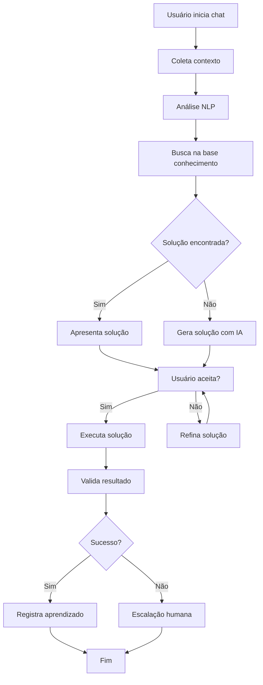
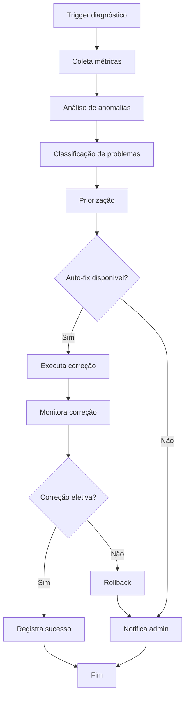
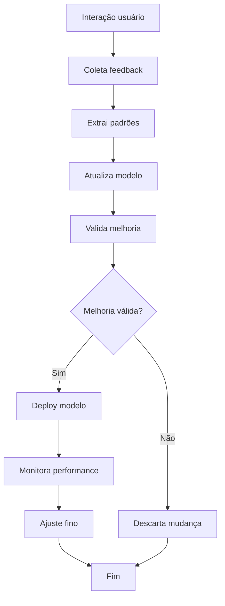

# 🤖 Especificação Técnica - IA de Contexto e Suporte
## SenseiSystem - Assistente Inteligente para Gestão de Academias

---

## 📋 Índice

1. [Visão Geral](#visão-geral)
2. [Arquitetura da IA](#arquitetura-da-ia)
3. [Base de Conhecimento](#base-de-conhecimento)
4. [Funcionalidades Principais](#funcionalidades-principais)
5. [Sistema de Context Awareness](#sistema-de-context-awareness)
6. [Detecção e Resolução de Problemas](#detecção-e-resolução-de-problemas)
7. [Interface de Integração](#interface-de-integração)
8. [Especificações Técnicas](#especificações-técnicas)
9. [Fluxos de Operação](#fluxos-de-operação)
10. [Métricas e Monitoramento](#métricas-e-monitoramento)

---

## 1. Visão Geral

### 1.1 Propósito
Desenvolver um sistema de IA especializado que atue como assistente técnico inteligente para o SenseiSystem, capaz de:

- **Suporte Contextualizado**: Entender o contexto do usuário e da academia
- **Diagnóstico Automático**: Identificar problemas no sistema
- **Resolução Inteligente**: Sugerir e executar correções
- **Aprendizado Contínuo**: Melhorar com base nas interações
- **Suporte Multi-nível**: Atender admin, professores e alunos

### 1.2 Escopo Funcional
```
┌─────────────────────────────────────────┐
│             IA SENSEISYSTEM             │
├─────────────────────────────────────────┤
│ • Suporte Técnico Inteligente           │
│ • Resolução de Problemas                │
│ • Otimização de Performance             │
│ • Análise Preditiva                     │
│ • Automação de Tarefas                  │
│ • Relatórios Inteligentes               │
└─────────────────────────────────────────┘
```

---

## 2. Arquitetura da IA

### 2.1 Componentes Principais

#### 2.1.1 Core Engine
```typescript
interface AICore {
  contextAnalyzer: ContextAnalyzer;
  problemDetector: ProblemDetector;
  solutionEngine: SolutionEngine;
  learningModule: LearningModule;
  knowledgeBase: KnowledgeBase;
}

class SenseiAI {
  private core: AICore;
  private integrations: SystemIntegrations;
  private analytics: AnalyticsEngine;
  
  async analyzeContext(request: UserRequest): Promise<ContextInfo> {
    // Análise do contexto atual do usuário
  }
  
  async detectIssues(systemState: SystemState): Promise<Issue[]> {
    // Detecção proativa de problemas
  }
  
  async provideSolution(issue: Issue): Promise<Solution> {
    // Geração de soluções personalizadas
  }
}
```

#### 2.1.2 Sistema de Contexto
```typescript
interface ContextInfo {
  user: {
    id: number;
    role: 'admin' | 'instructor' | 'student';
    currentPage: string;
    lastActions: UserAction[];
    preferences: UserPreferences;
  };
  academy: {
    id: number;
    settings: AcademySettings;
    currentLoad: SystemLoad;
    activeFeatures: Feature[];
  };
  system: {
    performance: PerformanceMetrics;
    errors: ErrorLog[];
    integrations: IntegrationStatus[];
  };
  temporal: {
    timeOfDay: string;
    dayOfWeek: number;
    currentEvents: Event[];
  };
}
```

### 2.2 Arquitetura de Dados
```
┌─────────────────┐    ┌─────────────────┐    ┌─────────────────┐
│   Knowledge     │    │   Context       │    │   Learning      │
│   Base          │◄──►│   Engine        │◄──►│   Module        │
│                 │    │                 │    │                 │
│ • Documentação  │    │ • User State    │    │ • Patterns      │
│ • Procedures    │    │ • System State  │    │ • Feedback      │
│ • Solutions     │    │ • Environment   │    │ • Improvements  │
└─────────────────┘    └─────────────────┘    └─────────────────┘
         ▲                       ▲                       ▲
         │                       │                       │
         ▼                       ▼                       ▼
┌─────────────────────────────────────────────────────────────────┐
│                     AI DECISION ENGINE                          │
│                                                                 │
│ Input: Context + Knowledge → Processing → Output: Action/Response│
└─────────────────────────────────────────────────────────────────┘
```

---

## 3. Base de Conhecimento

### 3.1 Estrutura da Base de Conhecimento

#### 3.1.1 Documentação do Sistema
```typescript
interface SystemKnowledge {
  architecture: {
    frontend: ComponentDocumentation[];
    backend: APIDocumentation[];
    database: SchemaDocumentation[];
    integrations: IntegrationDocs[];
  };
  
  procedures: {
    userManagement: Procedure[];
    attendance: Procedure[];
    financial: Procedure[];
    reporting: Procedure[];
  };
  
  troubleshooting: {
    commonIssues: Issue[];
    solutions: Solution[];
    escalationPaths: EscalationPath[];
  };
  
  businessRules: {
    belts: BeltProgression[];
    payments: PaymentRules[];
    attendance: AttendanceRules[];
  };
}
```

#### 3.1.2 Base de Problemas Comuns
```typescript
const commonIssues = {
  authentication: [
    {
      id: 'AUTH_001',
      title: 'Usuário não consegue fazer login',
      symptoms: ['Erro de credenciais', 'Token expirado', 'Conta bloqueada'],
      solutions: [
        'Verificar credenciais no banco',
        'Regenerar token JWT',
        'Verificar status da conta'
      ],
      automation: 'resetUserSession(userId)'
    },
    {
      id: 'AUTH_002', 
      title: 'Redirecionamento incorreto após login',
      symptoms: ['URL incorreta', 'Página em branco', 'Loop de redirecionamento'],
      solutions: [
        'Verificar role do usuário',
        'Limpar cache do browser',
        'Verificar rotas protegidas'
      ],
      automation: 'fixUserRedirect(userId, targetPage)'
    }
  ],
  
  attendance: [
    {
      id: 'ATT_001',
      title: 'Presença não registrada',
      symptoms: ['Check-in falhou', 'Dados não salvos', 'Error 500'],
      solutions: [
        'Verificar conexão com banco',
        'Validar dados da aula',
        'Reprocessar attendance'
      ],
      automation: 'reprocessAttendance(studentId, classId, date)'
    }
  ],
  
  financial: [
    {
      id: 'FIN_001',
      title: 'Integração ASAAS falhando',
      symptoms: ['API timeout', 'Webhook não recebido', 'Status inconsistente'],
      solutions: [
        'Verificar API key ASAAS',
        'Reenviar webhook',
        'Sincronizar status de pagamento'
      ],
      automation: 'syncAsaasPayments(academyId)'
    }
  ]
};
```

### 3.2 Sistema de Versionamento
```typescript
interface KnowledgeVersion {
  version: string;
  timestamp: Date;
  changes: Change[];
  compatibility: string[];
}

class KnowledgeManager {
  async updateKnowledge(newData: KnowledgeUpdate): Promise<void> {
    // Versionar conhecimento atual
    // Aplicar atualizações
    // Validar compatibilidade
    // Notificar mudanças
  }
  
  async rollbackKnowledge(version: string): Promise<void> {
    // Reverter para versão anterior
  }
}
```

---

## 4. Funcionalidades Principais

### 4.1 Suporte Inteligente

#### 4.1.1 Chat Assistant
```typescript
interface ChatBot {
  processMessage(message: string, context: ContextInfo): Promise<Response>;
  generateSuggestions(context: ContextInfo): Promise<Suggestion[]>;
  escalateToHuman(issue: ComplexIssue): Promise<Ticket>;
}

class IntelligentSupport {
  async handleUserQuery(query: string, userId: number): Promise<SupportResponse> {
    const context = await this.contextAnalyzer.analyze(userId);
    const intent = await this.nlp.extractIntent(query);
    const solution = await this.solutionEngine.findSolution(intent, context);
    
    return {
      answer: solution.explanation,
      actions: solution.autoActions,
      followUp: solution.followUpQuestions,
      confidence: solution.confidence
    };
  }
}
```

#### 4.1.2 Diagnóstico Proativo
```typescript
class ProactiveDiagnostics {
  async runSystemCheck(): Promise<HealthReport> {
    const checks = [
      this.checkDatabasePerformance(),
      this.checkAPIEndpoints(),
      this.checkIntegrations(),
      this.checkUserExperience()
    ];
    
    const results = await Promise.all(checks);
    return this.generateHealthReport(results);
  }
  
  private async checkDatabasePerformance(): Promise<DBHealth> {
    // Verificar queries lentas
    // Analisar uso de índices
    // Detectar deadlocks
    // Monitorar conexões
  }
  
  private async checkUserExperience(): Promise<UXHealth> {
    // Analisar tempo de carregamento
    // Detectar erros JavaScript
    // Verificar acessibilidade
    // Monitorar conversões
  }
}
```

### 4.2 Resolução Automatizada

#### 4.2.1 Auto-healing System
```typescript
interface AutoHealing {
  detectAnomalies(): Promise<Anomaly[]>;
  attemptFix(anomaly: Anomaly): Promise<FixResult>;
  monitorFix(fixId: string): Promise<FixStatus>;
}

class AutoHealingEngine {
  private readonly healingActions = {
    'HIGH_CPU_USAGE': this.optimizeQueries,
    'MEMORY_LEAK': this.restartService,
    'API_TIMEOUT': this.adjustTimeout,
    'DB_CONNECTION_FAIL': this.reconnectDatabase,
    'ASAAS_SYNC_ERROR': this.retryAsaasSync
  };
  
  async heal(issue: SystemIssue): Promise<HealingResult> {
    const action = this.healingActions[issue.type];
    if (!action) {
      return { success: false, reason: 'No healing action available' };
    }
    
    try {
      await action(issue.parameters);
      await this.validateFix(issue);
      return { success: true, message: 'Issue resolved automatically' };
    } catch (error) {
      return { success: false, reason: error.message };
    }
  }
}
```

#### 4.2.2 Data Correction
```typescript
class DataCorrectionEngine {
  async detectDataInconsistencies(): Promise<DataIssue[]> {
    return [
      await this.checkOrphanedRecords(),
      await this.validateForeignKeys(),
      await this.checkDuplicates(),
      await this.validateBusinessRules()
    ].flat();
  }
  
  async fixDataIssue(issue: DataIssue): Promise<FixResult> {
    switch (issue.type) {
      case 'ORPHANED_STUDENT_PAYMENT':
        return await this.linkPaymentToStudent(issue.data);
      case 'MISSING_ATTENDANCE_RATE':
        return await this.recalculateAttendanceRate(issue.studentId);
      case 'INVALID_BELT_PROGRESSION':
        return await this.fixBeltProgression(issue.studentId);
    }
  }
}
```

### 4.3 Análise Preditiva

#### 4.3.1 Performance Forecasting
```typescript
class PerformanceForecast {
  async predictSystemLoad(timeframe: TimeFrame): Promise<LoadPrediction> {
    const historicalData = await this.getHistoricalMetrics(timeframe);
    const seasonality = this.analyzeSeasonality(historicalData);
    const trends = this.analyzeTrends(historicalData);
    
    return {
      expectedLoad: this.calculatePrediction(seasonality, trends),
      confidence: this.calculateConfidence(),
      recommendations: this.generateRecommendations()
    };
  }
  
  async predictChurnRisk(): Promise<ChurnPrediction[]> {
    const students = await this.getAllActiveStudents();
    const predictions = await Promise.all(
      students.map(student => this.analyzeChurnRisk(student))
    );
    
    return predictions.filter(p => p.riskLevel > 0.6);
  }
}
```

#### 4.3.2 Business Intelligence
```typescript
class BusinessIntelligence {
  async analyzeFinancialTrends(): Promise<FinancialInsights> {
    return {
      revenueGrowth: await this.calculateRevenueGrowth(),
      churnRate: await this.calculateChurnRate(),
      ltv: await this.calculateLifetimeValue(),
      seasonalPatterns: await this.analyzeSeasonalPatterns(),
      recommendations: await this.generateFinancialRecommendations()
    };
  }
  
  async optimizeClassSchedules(): Promise<ScheduleOptimization> {
    const attendanceData = await this.getAttendancePatterns();
    const capacityData = await this.getClassCapacities();
    
    return {
      suggestedChanges: this.calculateOptimalSchedule(attendanceData, capacityData),
      expectedImprovement: this.calculateImprovementMetrics(),
      implementationSteps: this.generateImplementationPlan()
    };
  }
}
```

---

## 5. Sistema de Context Awareness

### 5.1 Context Collection
```typescript
class ContextCollector {
  async collectUserContext(userId: number): Promise<UserContext> {
    return {
      currentSession: await this.getCurrentSession(userId),
      recentActions: await this.getRecentActions(userId, 24), // últimas 24h
      preferences: await this.getUserPreferences(userId),
      permissions: await this.getUserPermissions(userId),
      location: await this.getLocationContext(userId)
    };
  }
  
  async collectSystemContext(): Promise<SystemContext> {
    return {
      performance: await this.getPerformanceMetrics(),
      load: await this.getCurrentSystemLoad(),
      errors: await this.getRecentErrors(1), // última 1h
      integrations: await this.getIntegrationStatus(),
      maintenance: await this.getMaintenanceStatus()
    };
  }
  
  async collectBusinessContext(academyId: number): Promise<BusinessContext> {
    return {
      activeStudents: await this.getActiveStudentsCount(academyId),
      todaysClasses: await this.getTodaysClasses(academyId),
      recentEvents: await this.getRecentEvents(academyId),
      financialStatus: await this.getFinancialSummary(academyId),
      alerts: await this.getActiveAlerts(academyId)
    };
  }
}
```

### 5.2 Context Processing
```typescript
class ContextProcessor {
  async processContext(rawContext: RawContext): Promise<ProcessedContext> {
    const normalized = await this.normalizeContext(rawContext);
    const enriched = await this.enrichContext(normalized);
    const scored = await this.scoreContext(enriched);
    
    return {
      user: scored.user,
      system: scored.system,
      business: scored.business,
      priority: this.calculatePriority(scored),
      urgency: this.calculateUrgency(scored),
      complexity: this.calculateComplexity(scored)
    };
  }
  
  private calculatePriority(context: ScoredContext): Priority {
    // Algoritmo para calcular prioridade baseado em:
    // - Role do usuário
    // - Criticidade do sistema
    // - Impacto no negócio
    // - Urgência temporal
  }
}
```

---

## 6. Detecção e Resolução de Problemas

### 6.1 Problem Detection Engine

#### 6.1.1 Monitoring Rules
```typescript
interface MonitoringRule {
  id: string;
  name: string;
  condition: MonitoringCondition;
  severity: 'low' | 'medium' | 'high' | 'critical';
  autoFix: boolean;
  notification: NotificationConfig;
}

const monitoringRules: MonitoringRule[] = [
  {
    id: 'HIGH_ERROR_RATE',
    name: 'Taxa de erro elevada',
    condition: {
      metric: 'error_rate',
      operator: '>',
      threshold: 0.05, // 5%
      timeWindow: '5m'
    },
    severity: 'high',
    autoFix: true,
    notification: { channels: ['admin', 'slack'], immediate: true }
  },
  {
    id: 'SLOW_RESPONSE_TIME',
    name: 'Tempo de resposta lento',
    condition: {
      metric: 'response_time_p95',
      operator: '>',
      threshold: 2000, // 2s
      timeWindow: '10m'
    },
    severity: 'medium',
    autoFix: false,
    notification: { channels: ['admin'], immediate: false }
  }
];
```

#### 6.1.2 Anomaly Detection
```typescript
class AnomalyDetector {
  async detectAnomalies(timeframe: TimeFrame): Promise<Anomaly[]> {
    const metrics = await this.collectMetrics(timeframe);
    const anomalies: Anomaly[] = [];
    
    // Detecção baseada em thresholds
    anomalies.push(...this.detectThresholdAnomalies(metrics));
    
    // Detecção baseada em padrões
    anomalies.push(...this.detectPatternAnomalies(metrics));
    
    // Detecção baseada em ML
    anomalies.push(...await this.detectMLAnomalies(metrics));
    
    return this.prioritizeAnomalies(anomalies);
  }
  
  private async detectMLAnomalies(metrics: Metrics[]): Promise<Anomaly[]> {
    // Usar algoritmos de ML para detectar anomalias:
    // - Isolation Forest
    // - One-Class SVM
    // - Autoencoders
    // - LSTM para séries temporais
  }
}
```

### 6.2 Solution Engine

#### 6.2.1 Solution Matching
```typescript
class SolutionMatcher {
  async findSolutions(problem: Problem, context: ContextInfo): Promise<Solution[]> {
    const exactMatches = await this.findExactMatches(problem);
    const similarSolutions = await this.findSimilarSolutions(problem);
    const generatedSolutions = await this.generateSolutions(problem, context);
    
    const allSolutions = [...exactMatches, ...similarSolutions, ...generatedSolutions];
    return this.rankSolutions(allSolutions, context);
  }
  
  private async generateSolutions(problem: Problem, context: ContextInfo): Promise<Solution[]> {
    // Usar IA generativa para criar soluções customizadas
    const prompt = this.buildSolutionPrompt(problem, context);
    const aiResponse = await this.queryAI(prompt);
    return this.parseSolutions(aiResponse);
  }
  
  private rankSolutions(solutions: Solution[], context: ContextInfo): Solution[] {
    return solutions.sort((a, b) => {
      const scoreA = this.calculateSolutionScore(a, context);
      const scoreB = this.calculateSolutionScore(b, context);
      return scoreB - scoreA;
    });
  }
}
```

#### 6.2.2 Solution Execution
```typescript
class SolutionExecutor {
  async executeSolution(solution: Solution, context: ContextInfo): Promise<ExecutionResult> {
    // Validar pré-condições
    const validation = await this.validatePreconditions(solution, context);
    if (!validation.valid) {
      return { success: false, error: validation.error };
    }
    
    // Criar checkpoint para rollback
    const checkpoint = await this.createCheckpoint(solution.affectedSystems);
    
    try {
      // Executar solução
      const result = await this.runSolutionSteps(solution.steps);
      
      // Validar resultado
      const verification = await this.verifySolution(solution, result);
      
      if (verification.success) {
        await this.logSuccessfulExecution(solution, result);
        return { success: true, result };
      } else {
        await this.rollbackToCheckpoint(checkpoint);
        return { success: false, error: verification.error };
      }
      
    } catch (error) {
      await this.rollbackToCheckpoint(checkpoint);
      await this.logFailedExecution(solution, error);
      return { success: false, error: error.message };
    }
  }
}
```

---

## 7. Interface de Integração

### 7.1 API da IA

#### 7.1.1 Endpoints Principais
```typescript
// GET /api/ai/health - Status da IA
app.get('/api/ai/health', async (req, res) => {
  const health = await aiEngine.getHealthStatus();
  res.json(health);
});

// POST /api/ai/chat - Chat com assistente
app.post('/api/ai/chat', authenticateJWT, async (req, res) => {
  const { message } = req.body;
  const context = await contextCollector.collectContext(req.user.id);
  const response = await chatBot.processMessage(message, context);
  res.json(response);
});

// POST /api/ai/diagnose - Diagnóstico do sistema
app.post('/api/ai/diagnose', requireRole(['admin']), async (req, res) => {
  const diagnosis = await diagnosticsEngine.runFullDiagnosis();
  res.json(diagnosis);
});

// POST /api/ai/fix - Executar correção automática
app.post('/api/ai/fix', requireRole(['admin']), async (req, res) => {
  const { issueId, autoApprove } = req.body;
  const result = await autoHealing.attemptFix(issueId, autoApprove);
  res.json(result);
});
```

#### 7.1.2 WebSocket Events
```typescript
class AIWebSocketHandler {
  handleConnection(socket: WebSocket, userId: number) {
    // Eventos em tempo real da IA
    
    socket.on('ai:diagnose', async (data) => {
      const result = await this.runQuickDiagnosis(data, userId);
      socket.emit('ai:diagnosis', result);
    });
    
    socket.on('ai:monitor', async (data) => {
      // Iniciar monitoramento personalizado
      const monitor = await this.startPersonalizedMonitoring(data, userId);
      socket.emit('ai:monitoring_started', monitor);
    });
    
    // Notificações proativas
    this.setupProactiveNotifications(socket, userId);
  }
  
  private setupProactiveNotifications(socket: WebSocket, userId: number) {
    this.aiEngine.on('issue_detected', (issue) => {
      if (this.shouldNotifyUser(issue, userId)) {
        socket.emit('ai:issue_detected', issue);
      }
    });
    
    this.aiEngine.on('solution_available', (solution) => {
      if (this.shouldNotifyUser(solution, userId)) {
        socket.emit('ai:solution_suggested', solution);
      }
    });
  }
}
```

### 7.2 Frontend Integration

#### 7.2.1 AI Assistant Component
```typescript
// client/src/components/ai/AIAssistant.tsx
export function AIAssistant() {
  const [isOpen, setIsOpen] = useState(false);
  const [messages, setMessages] = useState<Message[]>([]);
  const [isTyping, setIsTyping] = useState(false);
  
  const sendMessage = async (text: string) => {
    const userMessage = { type: 'user', text, timestamp: new Date() };
    setMessages(prev => [...prev, userMessage]);
    setIsTyping(true);
    
    try {
      const response = await api.post('/ai/chat', { message: text });
      const aiMessage = { 
        type: 'ai', 
        text: response.data.answer,
        actions: response.data.actions,
        timestamp: new Date() 
      };
      setMessages(prev => [...prev, aiMessage]);
    } finally {
      setIsTyping(false);
    }
  };
  
  return (
    <div className="ai-assistant">
      <AIToggleButton onClick={() => setIsOpen(!isOpen)} />
      {isOpen && (
        <AIChatWindow
          messages={messages}
          onSendMessage={sendMessage}
          isTyping={isTyping}
        />
      )}
    </div>
  );
}
```

#### 7.2.2 Proactive Suggestions
```typescript
// client/src/components/ai/ProactiveSuggestions.tsx
export function ProactiveSuggestions() {
  const [suggestions, setSuggestions] = useState<Suggestion[]>([]);
  const { user } = useAuth();
  
  useEffect(() => {
    const loadSuggestions = async () => {
      const response = await api.get('/ai/suggestions');
      setSuggestions(response.data);
    };
    
    loadSuggestions();
    
    // Conectar WebSocket para sugestões em tempo real
    const ws = new WebSocket(`wss://api.senseisystem.com/ai/suggestions`);
    ws.onmessage = (event) => {
      const suggestion = JSON.parse(event.data);
      setSuggestions(prev => [suggestion, ...prev]);
    };
    
    return () => ws.close();
  }, [user]);
  
  return (
    <div className="proactive-suggestions">
      {suggestions.map(suggestion => (
        <SuggestionCard
          key={suggestion.id}
          suggestion={suggestion}
          onAccept={() => handleAcceptSuggestion(suggestion)}
          onDismiss={() => handleDismissSuggestion(suggestion)}
        />
      ))}
    </div>
  );
}
```

---

## 8. Especificações Técnicas

### 8.1 Requisitos de Performance

#### 8.1.1 Tempo de Resposta
```typescript
interface PerformanceTargets {
  chatResponse: '< 2s';        // Resposta do chat
  diagnostics: '< 30s';        // Diagnóstico completo
  autoFix: '< 5s';            // Correção automática
  contextAnalysis: '< 1s';     // Análise de contexto
  suggestions: '< 500ms';      // Sugestões proativas
}
```

#### 8.1.2 Disponibilidade
```typescript
interface AvailabilityTargets {
  uptime: '99.9%';            // Disponibilidade anual
  recovery: '< 1h';           // Tempo de recuperação
  detection: '< 5min';        // Detecção de problemas
  escalation: '< 15min';      // Escalação para humanos
}
```

### 8.2 Requisitos de Segurança

#### 8.2.1 Data Protection
```typescript
interface SecurityRequirements {
  dataEncryption: 'AES-256';
  apiAuthentication: 'JWT + RBAC';
  auditLogging: 'All AI actions logged';
  dataRetention: '90 days for logs, 1 year for insights';
  privacy: 'LGPD compliant';
}
```

#### 8.2.2 Access Control
```typescript
interface AIPermissions {
  read: {
    admin: ['all_data', 'all_logs', 'all_insights'];
    instructor: ['own_classes', 'own_students', 'basic_insights'];
    student: ['own_data', 'own_insights'];
  };
  
  execute: {
    admin: ['auto_fix', 'system_diagnostics', 'data_correction'];
    instructor: ['attendance_fix', 'grade_suggestions'];
    student: ['profile_optimization'];
  };
}
```

### 8.3 Escalabilidade

#### 8.3.1 Horizontal Scaling
```typescript
interface ScalingStrategy {
  aiProcessing: 'Microservices + Load Balancer';
  knowledgeBase: 'Distributed Database';
  contextCache: 'Redis Cluster';
  mlModels: 'Model Serving Pipeline';
  apiGateway: 'Rate Limiting + Caching';
}
```

#### 8.3.2 Resource Management
```typescript
class ResourceManager {
  async allocateResources(workload: AIWorkload): Promise<ResourceAllocation> {
    return {
      cpuCores: this.calculateCPUNeeds(workload),
      memory: this.calculateMemoryNeeds(workload),
      gpuTime: this.calculateGPUNeeds(workload),
      priority: this.calculatePriority(workload)
    };
  }
  
  private calculateCPUNeeds(workload: AIWorkload): number {
    // Chat: 1 core
    // Diagnostics: 2-4 cores
    // ML Inference: 4-8 cores
    // Batch Processing: 8+ cores
  }
}
```

---

## 9. Fluxos de Operação

### 9.1 Fluxo de Suporte



### 9.2 Fluxo de Diagnóstico



### 9.3 Fluxo de Aprendizado



---

## 10. Métricas e Monitoramento

### 10.1 KPIs da IA

#### 10.1.1 Efetividade
```typescript
interface AIMetrics {
  resolution: {
    firstContactResolution: number;  // % problemas resolvidos na primeira interação
    averageResolutionTime: number;   // Tempo médio de resolução
    autoFixSuccessRate: number;      // Taxa de sucesso das correções automáticas
    escalationRate: number;          // % casos escalados para humanos
  };
  
  quality: {
    userSatisfaction: number;        // Avaliação dos usuários (1-5)
    solutionAccuracy: number;        // Precisão das soluções sugeridas
    falsePositiveRate: number;       // Taxa de falsos positivos
    learningRate: number;            // Melhoria ao longo do tempo
  };
  
  performance: {
    responseTime: number;            // Tempo médio de resposta
    availability: number;            // Disponibilidade do sistema
    throughput: number;              // Requests processados por segundo
    resourceUtilization: number;     // Uso de recursos (CPU/Memory)
  };
}
```

#### 10.1.2 Dashboard de Monitoramento
```typescript
// client/src/pages/ai/MonitoringDashboard.tsx
export function AIMonitoringDashboard() {
  const [metrics, setMetrics] = useState<AIMetrics>();
  const [alerts, setAlerts] = useState<Alert[]>([]);
  
  return (
    <div className="ai-monitoring">
      <MetricsGrid metrics={metrics} />
      <AlertsList alerts={alerts} />
      <PerformanceCharts />
      <LearningProgress />
      <ResourceUsage />
    </div>
  );
}
```

### 10.2 Alertas Inteligentes

#### 10.2.1 Sistema de Alertas
```typescript
interface SmartAlert {
  id: string;
  severity: 'info' | 'warning' | 'error' | 'critical';
  category: 'performance' | 'security' | 'business' | 'technical';
  title: string;
  description: string;
  suggestedActions: Action[];
  autoResolve: boolean;
  threshold: AlertThreshold;
}

class SmartAlertSystem {
  async processAlert(metric: Metric): Promise<void> {
    const alerts = await this.evaluateThresholds(metric);
    
    for (const alert of alerts) {
      await this.enrichAlert(alert);
      await this.suggestActions(alert);
      
      if (alert.autoResolve) {
        await this.attemptAutoResolve(alert);
      } else {
        await this.notifyStakeholders(alert);
      }
    }
  }
}
```

### 10.3 Relatórios de Inteligência

#### 10.3.1 Relatório Executivo
```typescript
interface ExecutiveReport {
  period: DateRange;
  summary: {
    totalInteractions: number;
    resolutionRate: number;
    timeSaved: number;        // Horas economizadas
    costSavings: number;      // Economia em R$
    userSatisfaction: number;
  };
  
  insights: {
    commonIssues: IssueFrequency[];
    performanceTrends: Trend[];
    improvementAreas: Improvement[];
    successStories: SuccessCase[];
  };
  
  recommendations: {
    shortTerm: Recommendation[];
    longTerm: Recommendation[];
    investments: InvestmentRecommendation[];
  };
}
```

---

## 📋 Resumo da Especificação

### Componentes Principais:
- 🧠 **Core AI Engine** - Processamento inteligente
- 📚 **Knowledge Base** - Base de conhecimento versionada
- 🔍 **Context Analyzer** - Análise de contexto em tempo real
- 🛠️ **Auto-healing** - Correção automática de problemas
- 📊 **Analytics Engine** - Análise preditiva e BI
- 💬 **Chat Assistant** - Interface conversacional
- 🚨 **Alert System** - Alertas inteligentes

### Tecnologias Sugeridas:
- **Backend**: Node.js + TypeScript + WebSockets
- **AI/ML**: TensorFlow.js + Natural + OpenAI API
- **Database**: PostgreSQL + Redis (cache)
- **Monitoring**: Prometheus + Grafana
- **Deploy**: Docker + Kubernetes

### Benefícios Esperados:
- ⚡ **50-70%** redução no tempo de resolução
- 🎯 **80-90%** precisão no diagnóstico
- 💰 **40-60%** redução em custos de suporte
- 😊 **90%+** satisfação dos usuários
- 🚀 **24/7** disponibilidade inteligente

Esta especificação fornece um roadmap completo para implementação de uma IA contextual e inteligente no SenseiSystem, capaz de fornecer suporte técnico avançado e resolver problemas de forma proativa.
